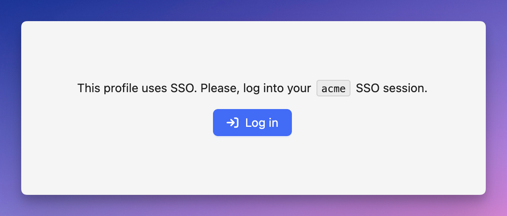

# 🔑 AWS credentials 

GraphBolt only uses your local credentials in order to authenticate against your AWS accounts. Those credentials remain safe and secure. Everything happens on *your* machine. 

We automatically detect the profiles that are configured in your credential files (e.g. `~/.aws/credentials` and/or `~/.aws/config`). 

To start working from a specific account, pick a profile from the top bar.

The following methods are supported:

### Short or long-term credentials

Those are the keys stored in the credentials file. i.e. `aws_access_key_id`, `aws_secret_access_key`, and optionally `aws_session_token`.

:::tip
At GraphBolt, we recommend that you use [Leapp](https://leapp.cloud) in order to manage your short-term credentials.
:::

### Single Sign-On

GraphBolt supports AWS Single Sign-On. If you have [configured SSO profiles](https://docs.aws.amazon.com/cli/latest/userguide/sso-configure-profile-token.html) on your local machine, GraphBolt will detect them and prompt you to login if necessary.

