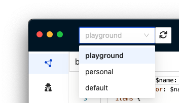

# 🚀 Getting started

## What is GraphBolt?

GraphBolt is the ultimate tool for AWS AppSync developers, providing a comprehensive solution for building, testing, and debugging APIs.

## Setup

The only thing you need to get started is to have your [AWS profiles](https://docs.aws.amazon.com/cli/latest/userguide/cli-configure-profiles.html) configured on your machine. When you open GraphBolt, it will automatically detect them and discover all the AppSync APIs that you have in your accounts. You will find the available profiles in the top bar.

