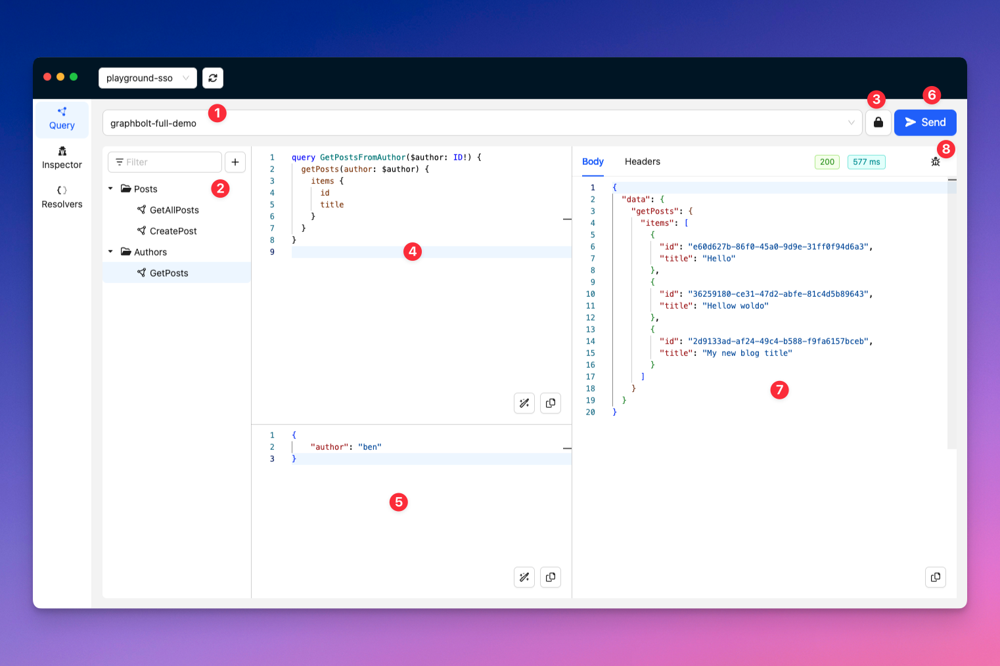

# GraphQL client

The GraphQL client allows you to execute queries, mutations, and subscriptions with ease. Think of it as [Postman](https://www.postman.com/) or [Insomnia](https://insomnia.rest/) specifically designed and tailored for AWS AppSync.

:::tip
GraphBolt explores your AWS accounts and finds all your existing AppSync APIs. Just select one from the drop-down menu, authenticate, and start executing queries.
:::

## Overview 

The client view is composed of various sections, explained below.

| # | Description |
|--|--|
| 1 | API picker   This is how you select the API you would like to work with. You don't need to enter the API URL, it is detected automatically. | 
| 2 | [Authentication](./authentication)  Opens the authentication window. For more information, read the [authentication](./authentication) section.
| 3 | The Query view  This is where you write the GraphQL queries, mutations and subscriptions you would like to execute.  |
| 4 | The variable view  If you use queries that have input variables, this is where you can enter their values, as a JSON. |
| 5 | The execute button  Press this button to execute the current request. |
| 6 | The response view  This is where the result of the request is shown when returned by the API. |
| 7 | The debug button  After you execute a request, this button will take you directly to the [Query Inspector](/query-inspector/query-details) for that request.

## Key Features

The GraphQL client includes the following features:

### Autocomplete

GraphBolt uses the introspection schema in order to provide you with autocomplete capabilities and help you write your queries.

### Multiple Operations

You are allowed to write more than one query, mutation or subscription in the request view. When you hit the _Send_ button, GraphBolt will prompt you to select which operation you'd like to use. All operations must be [named](https://graphql.org/learn/queries/#operation-name).

:::info
In the future, you will be able to group and organize your operations into collections. See [roadmap](https://github.com/orgs/graphboltdev/projects/1/views/1?query=is%3Aopen+sort%3Aupdated-desc&filterQuery=colle&pane=issue&itemId=11954307)
:::

### Keyboard Shortcuts

| Combination | Action |
| -- | -- |
| `Cmd/Ctrl + R` `Cmd/Ctrl + Enter` | Execute the request |
| `Cmd/Ctrl + Shift + A` | Open the auth modal |
| `Cmd/Ctrl + Shift + D` | Go to the query inspector for the last executed query |
