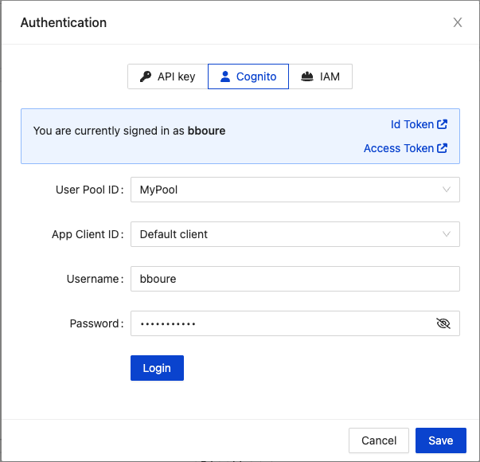
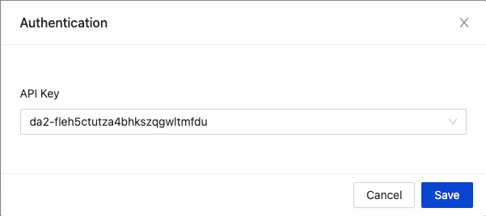
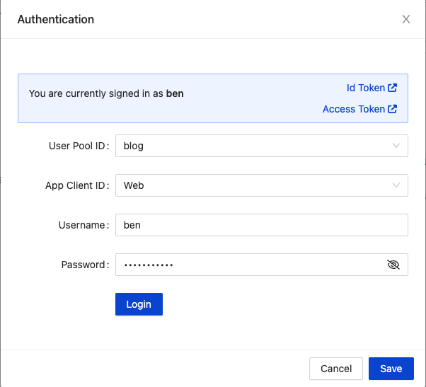
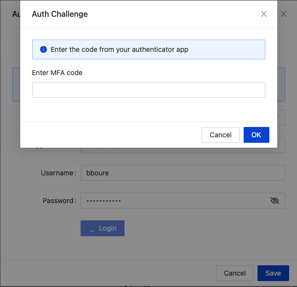
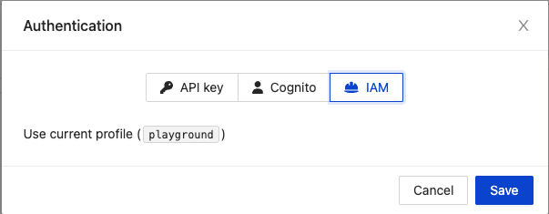

# Authentication

One of the key features of GraphBolt, is that it automatically detects the authentication methods of your APIs and makes it easy to authenticate your requests.

To authenticate, click on the 🔒 icon from the Query Client window.

GraphBolt will show you the available authentication methods for the currently selected API.

## API Keys

If your API has `API_KEY` as an authentication method, GraphBolt automatically fetches all the available API keys. Just select the one you want to use from the dropdown menu.

## Cognito User Pools

When `AMAZON_COGNITO_USER_POOLS` authentication is enabled, GraphBolt will prompt you to select the User Pool you want to use (only user pools linked to the currently selected API are shown), the App Client Id, the username and password.

> 💡 GraphBolt automatically manages the JWT session for you. That means that if the token expires, it will use the `refreshToken` to grab a new one. 

MFA and Password reset prompts authentication challenges are also supported out of the box.

## IAM

You can also use `AWS_IAM` as the authentication method. For now, IAM is limited to using the current AWS profile.

## Lambda authorizer and OIDC

OIDC and Lambda authorizer are also supported. Just enter your authentication token.
