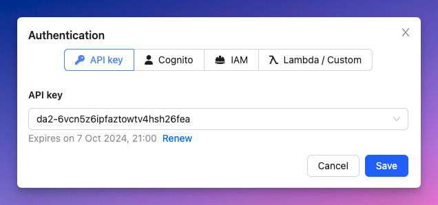

# Authentication

One of the key features of GraphBolt, is that it automatically detects the authentication methods of your APIs and makes it easy to authenticate your requests.

To authenticate, click on the 🔒 icon (`Cmd/Ctrl + Shift + A`) from the Query Client window.

GraphBolt will show you the available authentication methods for the currently selected API.

## API Keys

If your API has `API_KEY` as an authentication method, GraphBolt automatically fetches all the available API keys. Just select the one you want to use from the dropdown menu.

## Cognito User Pools

When `AMAZON_COGNITO_USER_POOLS` authentication is enabled, GraphBolt will prompt you to select the User Pool you want to use (only user pools linked to that API are shown), the App Client Id, the username and password.

:::tip
Clicking on _Id Token_ or _Access Token_ in the info window, will take you to https://jwt.io/ to vizualize the content of that token.
:::

:::info
GraphBolt automatically manages the JWT session for you. If a `refreshToken` is available, it will use it to refresh the access token. 
:::

:::info
_MFA_ and _Password Reset_ auth challenges are supported out of the box. A new modal will show up if the current flow requires a challenge. Other challenges are not yet supported.

:::

## IAM

You can also use `AWS_IAM` as the authentication method. For now, IAM is limited to using the current AWS profile. The _access key_, _secret access key_ and _session token_ values are passed automatically when IAM is selected in the auth modal.

## Lambda authorizer and OIDC

OIDC and Lambda authorizer are also supported. Just enter your authentication token.
