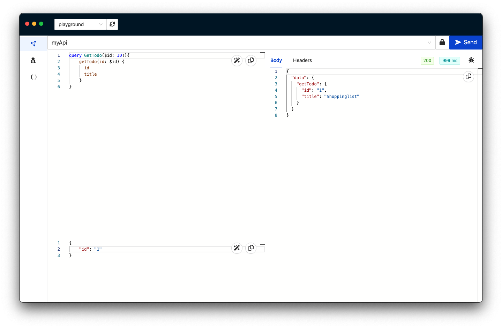

# The client view



The client view is composed of various sections, explained below.


**1. API selector**

This is how you select the API you would like to work with.

**2. Authentication**

This button opens the authentication window. For more information, read the [authentication](authentication) section.

**3. The Query view**

This is where you write the GraphQL queries, mutations and subscriptions you woud like to execute. 

**4. The variable view**

If you use queries that have input variables, this is where you can enter their values, as a JSON.

**5. The execute button**

Press this button to execute the current request.

**6. The response view**

This is where the result of the request is shown when returned by the API.

**7. The debug button**

After you execute a request, this button will take you directly to the [Query Inspector](/query-inspector/query-details) for that request.

```mdx-code-block
import DocCardList from '@theme/DocCardList';

<DocCardList />
```
