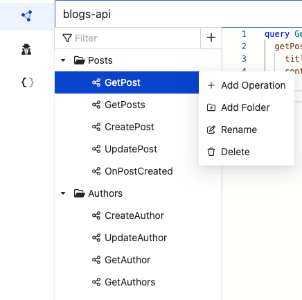

# Operation Collections

You can easily manage and categorize your queries by organizing them into collections. This feature enables you to perform the following actions:

- Create, edit, and delete queries, mutations, and subscriptions with ease.
- Group your queries into folders based on their functionality or any other criteria you prefer.
- Quickly find specific queries using the filter function, making it effortless to locate the specific query you need.

