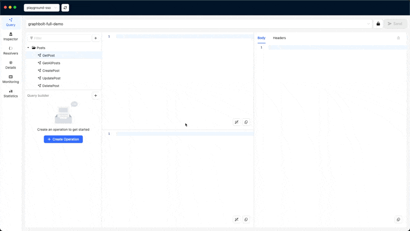

# Query Builder

The Query Builder allows you to quickly and easily generate GraphQL requests.  First, select the operation type (Query, Mutation, or Subscription), then chose which arguments and fields to include by clicking on them. The resulting query will be generated and displayed in the query editor in real time. 

