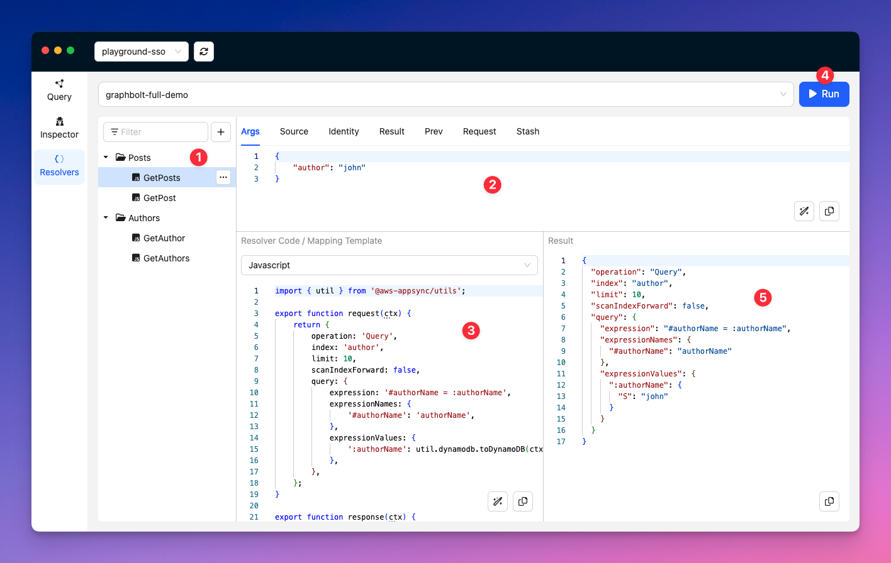

# Resolver Evaluation

This tool allows you to quickly build and test your VTL mapping templates or AppSync JavaScript Resolvers. At the moment, this is nothing else than a friendly GUI for the [evaluate-mapping-template](https://docs.aws.amazon.com/cli/latest/reference/appsync/evaluate-mapping-template.html) and [evaluate-code](https://docs.aws.amazon.com/cli/latest/reference/appsync/evaluate-code.html) aws cli commands.

| # | Description |
|--|--|
| 1 | [Resolvers Collection](./collections.md)    Keep your resolvers organized. | 
| 2 | Context Object   This is is where you can enter the data that will be used as the `context` to evaluate the resolver. It is split into several tabs where each tab is one field of the [context object](https://docs.aws.amazon.com/appsync/latest/devguide/resolver-context-reference-js.html).   All values should be represented as a JSON object. |
| 3 | Mapping Template / JS Resolver code   This is where you can write your VTL mapping template, or JavaScript resolver code. Select the runtime you want to use from the dropdown, and write or paste your resolver in the code editor. |
| 4 | Click to evaluate the resolver |
| 5 | Evaluation Result   This is where the result of the evaluation is shown. |

## Keyboard Shortcuts

| Combination | Action |
| -- | -- |
| `Cmd/Ctrl + R` `Cmd/Ctrl + Enter` | Execute the request |
