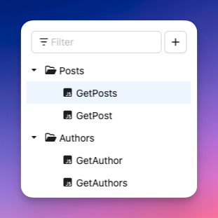

# Collections

You can easily manage and categorize your resolvers by organizing them into collections. This feature enables you to perform the following actions:

- Create, edit, and delete JS resolvers or VTL mapping templates.
- Group them logically into folders.
- Quickly find specific resolvers using the filter function.

