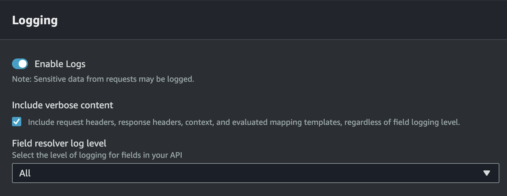

# Query Inspector 

The query inspector gives you the ability to dive deep into the execution of your resolvers, quickly find issues, and optimize your API performance.

:::caution
GraphBolt relies heavily on CloudWatch logs in order to ingest the data it needs in order to inspect your API requests. To get the most out of the query inspector, make sure that you enable logs, check the `Include verbose content` option, and set `Field resolver log level` to `All`.

:::
