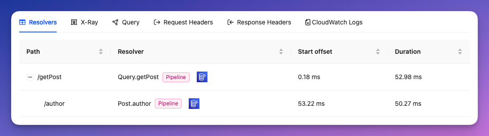

# Query details

The section gives you detailed information of what happened under the hood when a specific query was executed. It allows you to quickly find problems and work on improving your APIs performance.

In the top section, you will find general information about the selected request:

| Field | Description |
| -- | -- |
| Api |  The API id this query belongs to.
| Operation name |  The name of the operation that was executed, or the name of the first query/muation in the request. |
| Duration |  How long this query took. |
| Latency | The latency of the request. |
| Start and end times |  The start and end time of the request. |

Below, you will find a series of tabs that give deeper information.

# Resolvers

This is a list of all the fields that were resolved by a resolver. They are presented hierarchially, respecting their parent/child relationship.

This section gives you additional informaiton about each field/resolver:

| Column | Description |
| ---  | --- | 
| Path|  The full path of the resolved field in the query. |
| Resolver| The parent type and field name of the executed resolver. Next to it you'll see what kind of resolver it is (i.e. `Unit` or `Pipeline`), and an icon representing the underlying data source(s) that were used to resolve this field. |
| Start offset| The difference in time between the beginning of this resolver and the start of the request.|
| Duration| How long this invocation lasted.|
| 👁 | Click to see [resolver details](./resolver-details) |

# Query

This tab shows the query that was executed along with the input variables (if any).

# Request and response headers

A list of all the HTTP request or response headers of the HTTP request.

# Raw logs
This includes all the logs related to this query (as seen in AWS CloudWatch).

