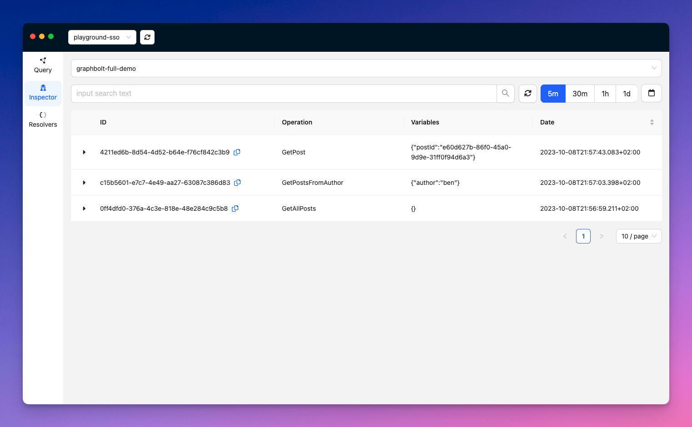

# Recent queries

On this screen, you will find a list of the queries that were recently executed, for a given API, along with some information such as the query/operation, the input variables, the request id, and the timestamp.

You can filter the list by date-range, or by text (e.g. you can search for a specific operation name, or a request id).

By clicking on the 👁, you can get more information about a specific request. See the [Query details](query-details) section for more details. 

