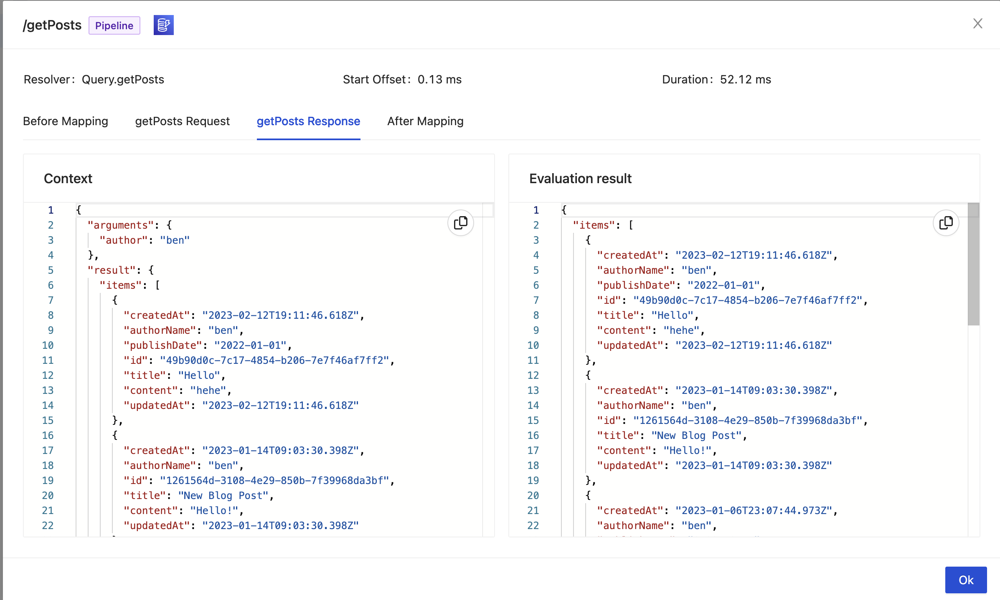

# Resolver details

This window provides information about what happened inside a specific resolver execution.

## General details

In the title bar you'll find:

- The path of the selected resolver
- The kind of resolver: `Unit` or `Pipeline`
- The underlying data sources

In the top section, you will also find:

- The parent type and filed name of the resolver
- The start offset
- The total duration of this execution

## Mapping template details

In the main content of the window, you will find several tabs. Each tab represents one "stage" of the execution workflow. 

For `Unit` resolver, that will be the request mapping template and the response mapping template.

For `Pipeline` resolvers, you will find:
- The before mapping template
- A request and response mapping template for each function in the pipeline
- The after mapping template

Each "stage" (tab) can contain the following sections.

### Context

This is the content of the `context` object at that moment in the workflow.

:::caution Warning
For security reasons, the `identity` field is not accessible.
:::

### Evaluation Result

This is how the mapping template, or Javascript code, was evaluated. For request mapping templates, this is the request sent to the data source. For response mapping templates, this is the result returned by the resolver or pipeline function.
