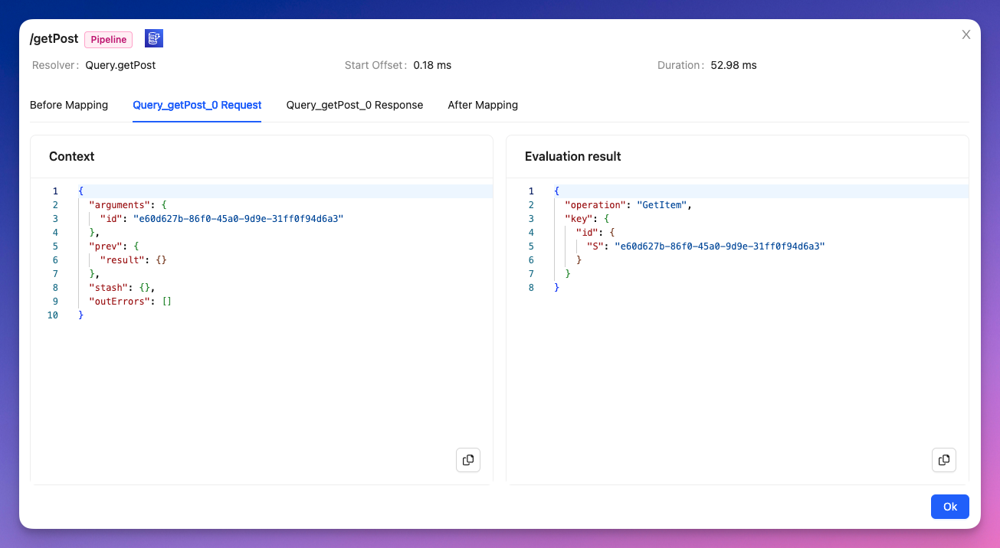

# Resolver Details

This window provides information about what happened inside a specific resolver execution.

## General Details

In the title bar you'll find:

- The path of the selected resolver
- The kind of resolver: `Unit` or `Pipeline`
- The underlying data sources

In the top section, you will also find:

- The parent type and field name of the resolver
- The start offset
- The total duration of this execution

## Mapping Template Details

In the main content of the window, you will find several tabs. Each tab represents one step of the execution workflow. 

For `Unit` resolver, that will be the request mapping template and the response mapping template.

For `Pipeline` resolvers, you will find:
- The before mapping template
- A request and response mapping template for every function in the pipeline
- The after mapping template

Steps (tab) are in order of execution and contain the following sections.

### Context

This is the content of the `context` object at that moment in the workflow. In other words, the `$context` object as seen by that mapping template.

:::caution Warning
For security reasons, the `identity` field is not accessible.
:::

### Evaluation Result

This is how the mapping template, or Javascript code, was evaluated. For request mapping templates, this is the request sent to the data source. For response mapping templates, this is the result returned by the resolver or pipeline function to GraphQL.

### Early Returned Value

If you used the [`#return` directive](https://docs.aws.amazon.com/appsync/latest/devguide/aws-appsync-directives.html) in a mapping template, the early value returned value is shown.

### Errors

Any error occurring in the evaluation/compilation of the mapping template are highlighted.

